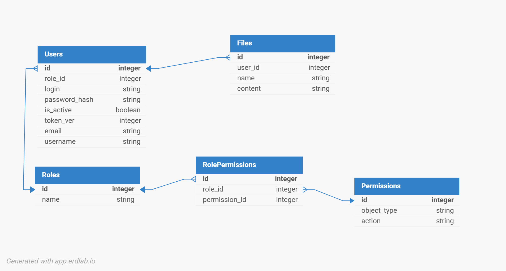

# Тестовое задание
## Направление

```Junior-python```

## Переменные окружения

```CryptContext``` - алгоритм шифрования паролей

```DB_URL``` - строка подключения к БД

```JWT_ALGORITM``` - Алгоритм шифрования ключей/токенов

```JWT_SECRET``` - Секрет для алгоритма шифрования

## Установка и запуск

### Установка зависимостей:

pip install -r requirements.txt

### Запуск в командной строке:

uvicorn app.main:app --reload

## Стек

Python 3.13, SQLAlchemy, FastAPI, pydantic

## БД

Приложение само разворачивает следующую БД

### ER-Диаграмма



### Описание таблиц

* **Users** - Информация о пользователе
    * **role_id** - id роли пользователя
    * **login** - Логин
    * **password_hash** - Хэш пароля, а не сам пароль
    * **is_active** - Состояние пользователя (True-Активен, False-Заблокирован)
    * **token_ver** - Версия токена (logout меняет версию)
    * **email** - Электронная почта (Формат проверяется через pydantic)
    * **username** - Имя пользователя в системе

* **Roles** - Информация о ролях
    * **name** Название роли

* **Permissions** - Разрешения/права для взаимодействия с объектами
    * **object_type** ресурс к которому можно обратится (базово существуют
      file & role)
    * **action** Действие с ресурсом
* **RolePermissions** Реализация связи многие ко многим для таблиц Roles &
  Permissions

* **Files** - Файлы пользователей
    * **user_id** - id владельца файла (пользователя)
    * **name** - Название файла
    * **content** - Содержание файла

## Роли и их разрешения в проекте

<table>
    <thead>
        <tr>
            <td>
                Что разрешено
            </td>
            <td>
                Админ
            </td>
            <td>
                Помощник
            </td>
            <td>
                Пользователь
            </td>
        </tr>
    </thead>
    <tr>
        <td>
            Давать роли
        </td>
        <td>
            Да
        </td>
        <td>
            Нет
        </td>
        <td>
            Нет
        </td>
    </tr>
    <tr>
        <td>
            Изменять роли
        </td>
        <td>
            Да
        </td>
        <td>
            Нет
        </td>
        <td>
            Нет
        </td>
    </tr>
    <tr>
        <td>
            Удалять роли
        </td>
        <td>
            Да
        </td>
        <td>
            Нет
        </td>
        <td>
            Нет
        </td>
    </tr>
    <tr>
        <td>
            Создавать файлы
        </td>
        <td>
            Да
        </td>
        <td>
            Да
        </td>
        <td>
            Да
        </td>
    </tr>
    <tr>
        <td>
            Создавать файлы Другим
        </td>
        <td>
            Да
        </td>
        <td>
            Нет
        </td>
        <td>
            Нет
        </td>
    </tr>
    <tr>
        <td>
            Изменять свои файлы
        </td>
        <td>
            Да
        </td>
        <td>
            Да
        </td>
        <td>
            Да
        </td>
    </tr>
    <tr>
        <td>
            Изменять ВСЕ файлы
        </td>
        <td>
            Да
        </td>
        <td>
            Нет
        </td>
        <td>
            Нет
        </td>
    </tr>
    <tr>
        <td>
            Удалять свои файлы
        </td>
        <td>
            Да
        </td>
        <td>
            Да
        </td>
        <td>
            Да
        </td>
    </tr>
    <tr>
        <td>
            Удалять ВСЕ файлы
        </td>
        <td>
            Да
        </td>
        <td>
            Нет
        </td>
        <td>
            Нет
        </td>
    </tr>
    <tr>
        <td>
            Просматривать свои файлы
        </td>
        <td>
            Да
        </td>
        <td>
            Да
        </td>
        <td>
            Да
        </td>
    </tr>
    <tr>
        <td>
            Просматривать ВСЕ файлы
        </td>
        <td>
            Да
        </td>
        <td>
            Да
        </td>
        <td>
            Нет
        </td>
    </tr>

</table>

## Базовые пользователи и роли

Базовые пользователи соответствуют базовым ролям представленным выше

Админ: Admin:Admin

Помощник: Helper:Helper

Пользователь: User:User

## Существующие обработчики

Существующие обработчики можно увидеть после запуска в ```/docs```